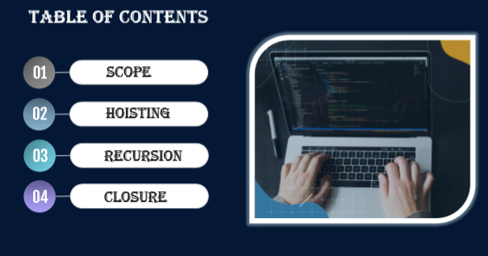
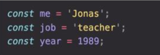
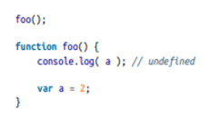
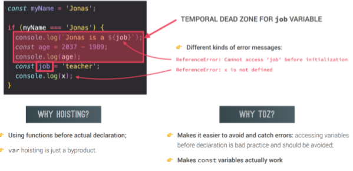
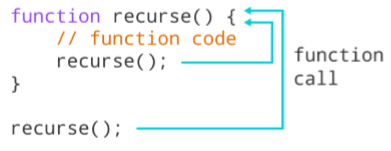
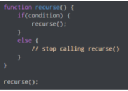
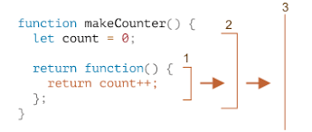

# lecture2
# Table of contents
### 1. -Scope
### 2. - Hoisting
### 3. -Recursion
### 4. -Closure


# What is Scope in Js?
> The scope is the current context of execution in which values and expressions are "visible" or can be referenced. If a variable or expression is not in the current scope, it will not be available for use. Scopes can also be layered in a hierarchy, so that child scopes have access to parent scopes, but not vice versa.

## Javascript has the following kinds of scopes

>  Global scope: The default scope for all code running in script mode. 
> Function scope: The scope created with a function
> Block scope: This scope restricts the variable that is declared inside a specific block, from access by the outside of the block. 
> Module scope: The scope for code running in module mode.

## Global scope 
> Outside of any functions or block
> Variables declared in global scope are accessible everywhere


## function scope 
> Variables are accessible only inside function,NOT outide
> Also called local scope


## Block scope 
> Variables are accesible only inside block(block scoped)
> HOWEVER , this only applies to let and const variables!
> Functions are also block scoped (only in strict mode)


# The scope chain 


# What is Hoisting in Js?
### Hoisting in Js 
> Hoisting is a JavaScript mechanism where variables and function declarations are moved to the top of their scope before code execution.
> Hoisting in JavaScript is a behavior in which a function or a variable can be used before declaration.


## Hoisting – Variable (var) 
> There’s a temptation to think that all of the code you see in a JavaScript program is interpreted line-by-line, top-down in order, as the program execute. While that is essentially true, there’s one part of that asassumption that can lead to incorrect thinking about your program.
> a = 2; var a; consol.log(a);

## Hoisting – function declaration
> So, one way of thinking, sort of metaphorically, about this process, is that variable and function declarations are “moved” from where they appear in the flow of the code to the top of the code. This gives rise to the name hoisting.

> The function foo’s declaration (which in this case includes the implied value of it as an actual function) is hoisted, such that the call on the first line is able to execute

# Temporal dead zone, let and const


## Why Hoisting? 
> Using functions beefore actual declaration;
> var hoisting  is just a byproduct.
## Why TDZ&
> Make it easier to avoid and catch errors:accesing variables before declaration isbad practice and should be avoided;
> Makes const variables actually work.

#  What is Recursion in JS?
## Recursion
> Recursion is when a function calls itself until someone stops it. If no one stops it then it'll recurse (call itself) forever. Recursive functions let you perform a unit of work multiple times. Modern programming languages like JavaScript already have the for and while statements as alternatives to recursive functions. But some languages like Closure do not have any looping statements, so you need to use recursion to repeatedly execute a piece of code.


> A recursive function must have a condition to stop calling itself. Otherwise, the function is called indefinitely.
Once the condition is met, the function stops calling itself. This is called the base condition.
To prevent infinite recursion, you can use if...else statement (or similar approach) where one branch makes the recursive call, and the other doesn't.


# Рекурсивна функция
> Рекурсивная функция - это функция, которая вызывает сама себя внутри своего тела.

Функция может вызывать сама себя многократно до выполнения определенного условия. Когда это условие выполняется, функция перестает вызывать саму себя и начинается возврат из всех уровней рекурсии.

Таким образом, рекурсивная функция использует свой собственный вызов в качестве механизма итерации для решения задачи. Это может быть полезным, если задача может быть сформулирована в терминах более простых решений и требует выполнения обратного отслеживания для достижения окончательного результата.

Одним из классических примеров рекурсивной функции является функция вычисления факториала. Функция для вычисления факториала может быть определена рекурсивно следующим образом:

```js
function factorial(n) {
  if (n <= 1) {
    return 1;
  } else {
    return n * factorial(n - 1);
  }
}

console.log(factorial(5)); // 120
```


В этой функции сначала проверяется базовое условие (n <= 1), и если оно выполняется, функция возвращает результат. Если базовое условие не выполнено, то функция вызывает сама себя, используя значение (n - 1)

# Closure functions 
>
Замыкание (closure) - это функция, которая имеет доступ к переменной из объемлющей функции (лексическое окружение), даже после того, как объемлющая функция была выполнена.

Это позволяет сохранять значения переменных между вызовами функции, которые могут быть использованы в дальнейшем вызове функции. Замыкания часто используются в JavaScript для создания функций высшего порядка и для создания приватных переменных и методов.

Замыкание может быть создано путем определения функции внутри другой функции и возвращения этой функции в качестве результата. В размышлениях этого примера замыкание функции `outer` включаает переменную `count`, которая сохранена между вызовами функции `outer`, и может быть изменена любым числом пользователей функции извне, используя возвращенную функцию:

```js
function outer() {
  let count = 0;
  
  function inner() {
    count++;
    console.log(count);
  }
  
  return inner;
}

const counter = outer(); // сохраняем возвращенную функцию

counter(); // 1
counter(); // 2
counter(); // 3
```


В этом примере, каждый новый вызов функции `counter()` увеличивает значение переменной `count`, которая была сохранена в замыкании в момент создания функции `inner`. Это позволяет сохранять и использовать значения между вызовами функции.

Замыкание также может использоваться для создания "приватных" переменных и методов в объектах, которые могут быть доступны только внутри объекта. Ключевой момент в создании замыкания является использование объемлющей функции для создания лексического окружения, в котором переменные или функции могут сохраняться для использования в вызове функции в будущем.